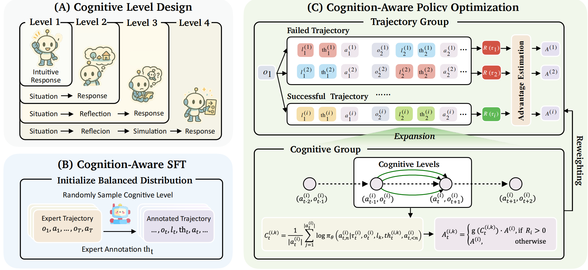

<div align="center">

# Think Fast and Slow: Step-Level Cognitive Depth Adaptation for LLM Agents


<a href='https://scholar.google.com/citations?user=asTSVwQAAAAJ&hl=en' target='_blank'><b>Ruihan Yang</b></a><sup>1</sup>&emsp;
<a href='https://scholar.google.com/citations?user=-dxasEcAAAAJ&hl=en' target='_blank'><b>Fanghua Ye</b></a><sup>2</sup>

<sup>1</sup>Fudan University&emsp;<sup>2</sup>Tencent Hunyuan

[](https://github.com/rhyang2021/CogRouter) 




</div>

CogRouter trains agents to **dynamically adapt cognitive depth at each step**. Grounded in ACT-R theory, we design four hierarchical cognitive levels ranging from instinctive responses to strategic planning, and propose **Cognition-aware Policy Optimization (CoPo)** for step-level credit assignment via confidence-aware advantage reweighting.

## Environment Setup

```bash
pip install -r requirements.txt
```

We recommend maintaining a separate conda environment for each environment.

**ALFWorld**

```bash
conda create -n copo-alfworld python=3.10 -y
conda activate copo-alfworld
pip install gymnasium==0.29.1
pip install stable-baselines3==2.6.0
pip install alfworld
```

Download PDDL & Game files (by default saved in `~/.cache/alfworld/`):

```bash
alfworld-download -f
```

**ScienceWorld**

```bash
conda create -n copo-sciworld python=3.10 -y
conda activate copo-sciworld
pip install scienceworld
```

Install verl and related dependencies:

```bash
pip install -e .
```

## Start Training

**RL Training**

```bash
bash examples/copo_trainer/run_alfworld.sh
```

```bash
bash examples/copo_trainer/run_sciworld.sh
```

## Customize

- **Cognitive Level Prompts**: Define or modify the hierarchical thinking level templates (Level 2–4) in `copo/prompt.py`.

- **CoPo Advantage Computation**: Adjust the confidence-aware advantage reweighting logic in `copo/core_copo.py`.

- **New Environments**: 
  1. Create your environment package in `agent_system/environments/env_package/`, following the gym interface with multi-threading support.
  2. Write corresponding prompts in `agent_system/environments/prompts/`.
  3. Add an environment manager in `agent_system/environments/env_manager.py`.

## Acknowledgement

We sincerely appreciate the infrastructure provided by [veRL](https://github.com/volcengine/verl) and [verl-agent](https://github.com/langfengQ/verl-agent). We also thank [ALFWorld](https://github.com/alfworld/alfworld), [ScienceWorld](https://github.com/allenai/ScienceWorld), and other projects for offering interactive agent environments.

If you have any questions, please feel free to [email](mailto:rhyang17@fudan.edu.cn) me or drop me an issue.