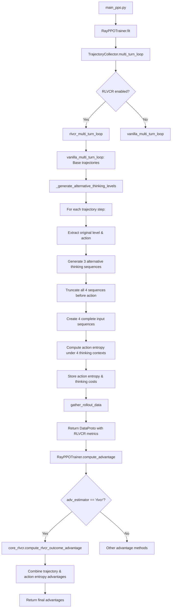

# RLVCR Complete Training Flow

## Overview

This document provides a comprehensive overview of the RLVCR (RL with Variational Chain Reasoning) training process, implementing the correct methodology for multi-level thinking evaluation.

## 🔥 Correct RLVCR Methodology

RLVCR evaluates **action entropy under different thinking levels** by:

1. **Fixing history and action**: For each step `<history, action>`, keep both components constant
2. **Generating thinking alternatives**: Generate 3 alternative thinking sequences for the other levels (1,2,3,4)
3. **Truncating before action**: Extract only the thinking part before `<action>` tag 
4. **Computing action logits**: Use the 4 thinking sequences + "<action>" as input to get model logits for the original action tokens
5. **Computing group advantage**: Calculate the original thinking level's advantage within the group of 4 logits

### Example Process:
```
Original (Level 3): "<level>3</level><think>I need to look around first</think><action>look around</action>"

Generate alternatives:
- Level 1: "<level>1</level>"  
- Level 2: "<level>2</level><think>Check state</think>"
- Level 4: "<level>4</level><think>Analyze goal, current state, possible actions...</think>"

Create 4 input sequences:
- "<level>1</level><action>look around</action>"
- "<level>2</level><think>Check state</think><action>look around</action>"  
- "<level>3</level><think>I need to look around first</think><action>look around</action>"
- "<level>4</level><think>Analyze goal...</think><action>look around</action>"

Compute action logits: Get model logits for "look around" tokens under these 4 different thinking contexts
Compute group advantage: Calculate Level 3's advantage within this group
```

## Flow Diagram



## Detailed Process

### 1. Initialization (main_ppo.py)
- Sets up PPO trainer with RLVCR configuration
- Configures `adv_estimator='rlvcr'` and enables RLVCR settings

### 2. Trajectory Collection (rollout_loop.py)
- `multi_turn_loop` checks if RLVCR is enabled
- If enabled, calls `rlvcr_multi_turn_loop` instead of vanilla sampling

### 3. RLVCR Sampling Process
1. **Base Collection**: Run vanilla trajectory collection first
2. **Alternative Generation**: For each (history, action) pair:
   - Extract original thinking level and action content
   - Generate thinking sequences for the other 3 levels using the same input history
   - Truncate all sequences before the `<action>` tag
3. **Action Logits & Group Advantage Computation**: 
   - Create 4 input prefixes: `thinking_sequence + "<action>"`
   - Get model logits for the original action tokens under different thinking contexts
   - Compute group-wise advantage for the original thinking level
4. **Data Storage**: Store computed thinking advantage and thinking costs

### 4. Data Structure
The RLVCR process adds these fields to the `DataProto.batch`:
```python
{
    'thinking_level_entropies': torch.Tensor,  # [batch_size, seq_len] - Thinking advantage within group
    'thinking_token_costs': torch.Tensor,      # [batch_size, seq_len] - Cost of thinking tokens
    # ... other standard batch data
}
```

### 5. Advantage Computation (ray_trainer.py)
- `compute_advantage` checks if `adv_estimator == 'rlvcr'`
- Calls `core_rlvcr.compute_rlvcr_outcome_advantage` with:
  - Token-level rewards (standard)
  - Thinking level entropies (thinking advantage within group)
  - Thinking token costs (efficiency metric)
  - Trajectory IDs for grouping

### 6. RLVCR Advantage Formula
The final advantage combines two components:
```python
final_advantage = trajectory_advantage + w * thinking_advantage
```

Where:
- **Trajectory advantage**: Normalized episode rewards (similar to existing methods)
- **Thinking advantage**: Based on group-wise advantage of the original thinking level
- **w**: Configurable weight (`step_advantage_w`)

## Key Implementation Features

### Entropy Calculation
- **True token-level entropy**: Following recent papers, computes $H_t = -\sum p_{t,j} \log p_{t,j}$
- **Group-based advantage**: Measures how good the chosen thinking level is compared to alternatives
- **Level tag exclusion**: Excludes `<level>X</level>` tokens from entropy calculation since they are forced

### Thinking Level Generation
- **Level-specific prompts**: Uses targeted instructions to encourage specific thinking levels
- **Action consistency**: Maintains the same action across all thinking levels
- **Truncation logic**: Properly extracts thinking sequences before action tags

### Error Handling
- **Fallback mechanisms**: Graceful handling when thinking level generation fails
- **Simplified entropy**: Placeholder entropy computation when true logits are unavailable
- **Robust parsing**: Multiple methods for extracting actions and thinking levels

## Configuration

Key RLVCR parameters in the config:
```yaml
algorithm:
  adv_estimator: 'rlvcr'
  rlvcr:
    enable: true
    step_advantage_w: 1.0      # Weight for thinking vs trajectory advantages
    thinking_diversity_w: 0.5  # Weight for thinking diversity
    mode: "mean_norm"          # Normalization mode
```

## Key Files Modified

1. **verl/trainer/ppo/ray_trainer.py**: Added RLVCR to AdvantageEstimator enum and compute_advantage function
2. **agent_system/multi_turn_rollout/rollout_loop.py**: Implemented RLVCR-specific trajectory collection with correct thinking generation logic
3. **rlvcr/core_rlvcr.py**: Core RLVCR algorithms for advantage computation and entropy calculation
4. **verl/trainer/config/ppo_trainer.yaml**: Added RLVCR configuration section

## Benefits

1. **Group-wise evaluation**: Measures how good the chosen thinking level is within the group of alternatives
2. **Multi-level reasoning**: Encourages the model to consider different depths of thinking
3. **Efficiency rewards**: Balances thinking quality with token efficiency
4. **Context sensitivity**: Learns when different thinking levels are most appropriate for different contexts